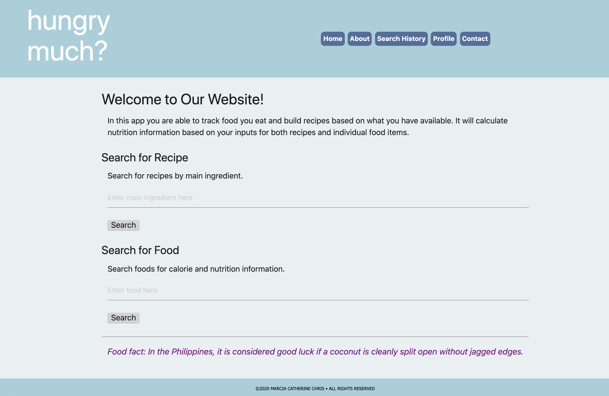
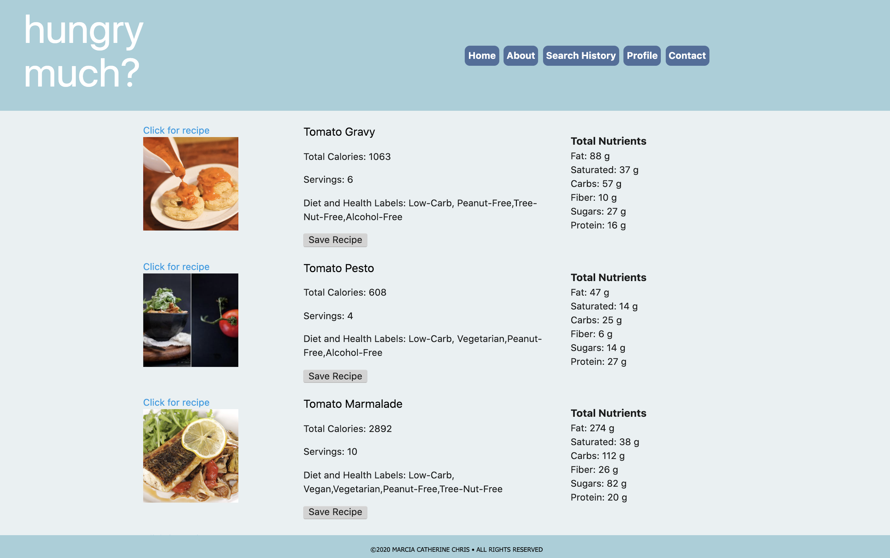
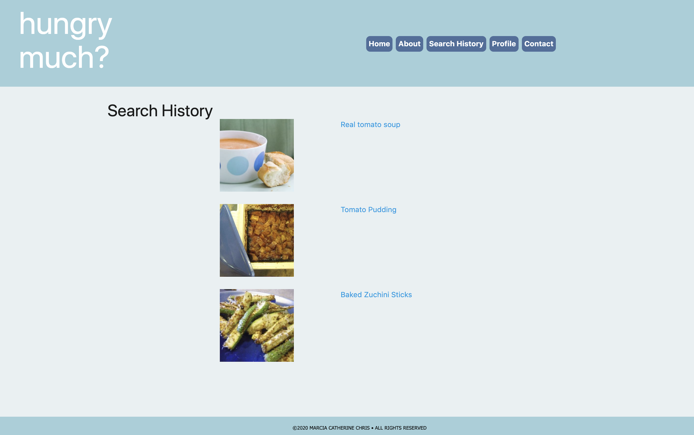

# hungry much?

## Project Name
hungry much?

Find recipes and nutritional information for the foods you are hungry for.

## Team Members
Catherine You, Chris Richter, Marcia Adler

## Our Pitch
Everyone is focused on health and we wanted to make it easier for users to know what the nutritional value of the food they are eating is. Our app provides users the ability to look up food, and also search for recipes based on ingredients they have and know what the nutritional information is so they can make informed decisions about what they make and eat.

## Concept
• Description
For our project we built an app where users are able to look up food they eat and find recipes based on main ingredients they have.  It provides nutritional information for individual food items and also for recipes that users find through the app.

• Motivation for development
We are all health conscious individuals, who like to know what we are eating.  We wanted to create an app we could use to search for recipes based on ingredients we had, as well as search for food items to know whats we are putting in our bodies.

• User Story
As a health conscious person, I want to know what I am putting in my body during the day so that I can be aware of what I need to meet nutritional requirements and make sure I am fueling my body as I need to

## Directions for Further development
• Create a profile page and the ability to create a user profile with individual information.

• The ability to log items into profile by day, and track nutritional values by day.

•  to input a recipe and calculate nutritional information for the entire recipe.

• Add ability to track fitness activities and calories burned.

## Links
• Deployed: https://chriscrichter.github.io/hungry-much/

• GitHub repo: https://github.com/chriscrichter/hungry-much/
